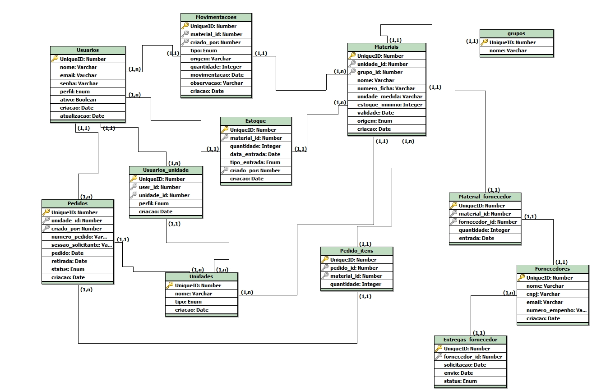

  <h1>Aplicativo de Gestão Administrativa - Guarnição de Caçapava</h1>
  <h3>Projeto de API - Fatec Prof° Jessen Vidal - 2º Semestre de 2025</h3>

  Projeto acadêmico desenvolvido por alunos do 5º semestre de DSM. O objetivo é digitalizar e automatizar
  a gestão de almoxarifado, substituindo controles manuais e descentralizados que dificultam o rastreamento
  de itens e impactam a eficiência operacional.

---

## 🗂️ Índice
- [Metodologia Utilizada](#-metodologia-utilizada)
- [Tecnologias Utilizadas](#️-tecnologias-utilizadas)
- [Requisitos do Projeto](#-requisitos-do-projeto)
- [Product Backlog](#-product-backlog)
- [Backlog da Sprint](#-backlog-da-sprint)
- [DoR (Definition of Ready)](docs/dor.md)
- [DoD (Definition of Done)](docs/dod.md)
- [Estrutura do Projeto](#-estrutura-do-projeto)
- [Modelo de Dados](#-modelo-de-dados)
- [Estratégia de Branching](docs/estrategia-de-branch.md)
- [Padrão de Commit](docs/padrao-de-commits.md)
- [Integrantes do Grupo](#-integrantes-do-grupo)

---

## 📋 Metodologia Utilizada

O framework de Metodologia Ágil utilizado no produto foi o **Scrum**, um método adaptativo, iterativo e eficaz para a gestão de projetos. O trabalho é organizado em Sprints, com cerimônias como Planejamento (Planning), Reuniões Diárias (Dailies) e Revisões (Review) para garantir entregas de valor contínuas e alinhadas às necessidades do cliente.

---

## 🖥️ Tecnologias Utilizadas

Estas foram as tecnologias escolhidas para a produção do projeto:

  
  
  
  
  
  

---

## 📖 Requisitos do Projeto

### Requisitos Funcionais

| Id   | Requisito Funcional                                                                                                                              |
| :--- | :----------------------------------------------------------------------------------------------------------------------------------------------- |
| RF01 | **Gestão de Itens:** Permitir o cadastro, edição e consulta de itens, incluindo nome, descrição, unidade de medida e estoque mínimo.               |
| RF02 | **Controle de Entradas e Saídas:** Registrar a entrada de novos materiais e a saída por requisição, atualizando o estoque em tempo real.           |
| RF03 | **Rastreabilidade com QR Code:** Gerar e ler QR Codes para identificar e consultar informações de itens rapidamente.                               |
| RF04 | **Alertas de Estoque Mínimo:** Notificar gestores quando um item atingir o nível de estoque mínimo pré-definido.                                    |
| RF05 | **Autenticação e Perfis de Acesso:** Implementar login e perfis de usuário (administrador, operador) com permissões específicas.                   |
| RF06 | **Relatórios Gerenciais:** Gerar relatórios sobre o status do inventário, movimentações por período e itens abaixo do mínimo.                      |
| RF07 | **Fonte de Dados Externos (Nota Fiscal):** Importar/integar com fonte de notas fiscais eletrônicas para reconciliar entradas e fornecedores.        |
| RF08 | **Envio de Alertas por E-mail (EBmail):** Disparar e-mails funcionais para gestores/fornecedores (alertas de estoque, confirmação de pedido, etc.).  |

### Requisitos Não Funcionais

| Id    | Requisito Não Funcional                                                                                                                     |
| :---- | :------------------------------------------------------------------------------------------------------------------------------------------ |
| RNF01 | **Usabilidade:** A interface deve ser intuitiva e de fácil utilização, com um mínimo de treinamento necessário.                             |
| RNF02 | **Performance:** Operações críticas (leitura de QR Code, atualização de estoque) devem ser concluídas rapidamente.               |
| RNF03 | **Segurança:** A comunicação entre app e API deve ser criptografada (HTTPS). Senhas devem ser armazenadas com hash.                         |
| RNF04 | **Manual de Instalação:** Documentação passo-a-passo para configurar ambiente de desenvolvimento e produção (docs/manual-de-instalacao.md). |
| RNF05 | **Manual do Usuário:** Guia de funcionalidades e fluxos do usuário (docs/manual-do-usuario.md).                                             |
| RNF06 | **Compatibilidade:** O aplicativo móvel deve ser compatível com as duas últimas versões dos sistemas operacionais Android e iOS.            |
| RNF07 | **Engenharia do Sistema:** O projeto deve seguir boas práticas de engenharia de software, garantindo modularidade, manutenibilidade e escalabilidade. |

---

## 📒 Product Backlog

| **Rank** | **Prioridade** | **User Story**                                                                                                                                                                                                                                         | **Estimativa** | **Sprint** |
|----------|----------------|---------------------------------------------------------------------------------------------------------------------------------------------------------------------------------------------------------------------------------------------------------|----------------|------------|
| 1        | Alta           | Como usuário do almoxarifado, quero cadastrar novos itens com nome, ficha, grupo, estoque mínimo, unidade, gerar QR code, escanear para adicionar novas quantidades e visualizar todos os itens com número da ficha, grupo e quantidade atual.         | 8              | 1          |
| 2        | Alta           | Como gestor, quero gerenciar os pedidos de materiais: cadastrar novos pedidos feitos pelas sessões, visualizar os pedidos em aberto, marcar como retirados com data de retirada, e visualizar o histórico de pedidos por sessão para entender o padrão de consumo. | 8              | 1          |
| 3        | Alta           | Como usuário, quero fazer login com e-mail e senha para acessar o sistema de acordo com meu perfil e acessar os módulos permitidos (almoxarifado, farmácia, etc.), com controle segmentado por unidade ou estoque.                                   | 5              | 1          |
| 4        | Alta           | Como administrador, quero cadastrar usuários com diferentes perfis (almoxarifado, farmácia, auxiliar), vinculá-los a unidades/estoques específicos, e garantir que tenham acesso somente ao que for permitido.                                     | 5              | 1          |
| 5        | Alta           | Como gestor, quero registrar perdas ou danos em materiais, editar ou excluir cadastros de itens ou pedidos com erros, e arquivar itens descontinuados ou fora de uso para manter o estoque atualizado e limpo.                                     | 5              | 1          |
| 6        | Alta           | Como gestor, quero visualizar os itens abaixo ou próximos do estoque mínimo, ver os materiais mais requisitados por frequência e acompanhar a demanda por meio de gráficos de coluna por grupo de materiais.                                       | 5              | 1          |
| 7        | Alta           | Como gestor, quero cadastrar fornecedores com nome, CNPJ, e-mail e número de empenho, visualizar a lista de fornecedores com status de entrega e e-mails enviados, e disparar e-mails automáticos para evitar atrasos.                             | 8              | 2          |
| 8        | Alta           | Como gestor, quero gerar relatórios de estoque em PDF ou Excel, incluindo os status de estoques (itens em falta, vencimentos, pedidos em aberto), para conferência com o sistema oficial.                                                          | 5              | 2          |
| 9       | Média          | Como administrador/gestor, quero visualizar um dashboard com os principais indicadores: itens em falta, vencimentos, pedidos em aberto, consumo por sessão, e alertas de estoque mínimo.                                                             | 5              | 2          |
| 10        | Média          | Como usuário, quero adicionar itens doados manualmente sem fornecedor e registrar a data de entrada de cada lote para controle e rastreabilidade completa.                                                                                           | 3              | 2          |
| 11       | Média          | Como gestor da farmácia, quero cadastrar medicamentos com data de validade e visualizar os medicamentos vencidos ou próximos do vencimento.                                                                                                          | 2              | 2          |
| 12       | Média          | Como sistema, quero registrar logs de ações realizadas (quem cadastrou, editou ou removeu pedidos/itens) para fins de auditoria e rastreabilidade.                                                                                                   | 5              | 3          |
| 13       | Média          | Como usuário, quero filtrar e listar os itens por grupo (limpeza, higiene, etc.) para facilitar a navegação no estoque.                                                                                                                              | 3              | 3          |
| 14       | Média          | Como farmácia, quero um campo de chat para comunicação com pacientes sobre agendamento e dúvidas.                                                                                                                                                    | 8              | 3          |
| 15       | Baixa          | Como usuário, quero receber notificações internas (sem e-mail) sobre pedidos pendentes, materiais vencendo ou próximos do mínimo, para facilitar o acompanhamento.                                                                                   | 3              | 3          |
| 16       | Baixa          | Como gestor, quero arquivar itens fora de uso ou descontinuados para não poluir visualizações do estoque ativo.                                                                                                                                      | 1              | 3          |

--- 

## 📆 Backlog da Sprint

| **Capacidade estimada da equipe por sprint**                   | 36 Story Points                                                  |
|:-------------------------------------------------------------:|:----------------------------------------------------------------:|
| **Meta da Sprint**                                            | User Stories de Rank 1, 2, 3, 4 (Total: 26 Story Points)         |
| **Previsão da Sprint (extras, sem compromisso de entrega)**   | User Stories de Rank 5 e 6 (Total: 10 Story Points)              |

 

| **Rank** | **Prioridade** | **User Story**                                                                                                                                                                                                                                         | **Estimativa** | **Sprint** |
|----------|----------------|---------------------------------------------------------------------------------------------------------------------------------------------------------------------------------------------------------------------------------------------------------|----------------|------------|
| 1        | Alta           | Como usuário do almoxarifado, quero cadastrar novos itens com nome, ficha, grupo, estoque mínimo, unidade, gerar QR code, escanear para adicionar novas quantidades e visualizar todos os itens com número da ficha, grupo e quantidade atual.         | 8              | 1          |
| 2       | Alta           | Como gestor, quero gerenciar os pedidos de materiais: cadastrar novos pedidos feitos pelas sessões, visualizar os pedidos em aberto, marcar como retirados com data de retirada, e visualizar o histórico de pedidos por sessão para entender o padrão de consumo. | 8              | 1          |
| 3        | Alta           | Como usuário, quero fazer login com e-mail e senha para acessar o sistema de acordo com meu perfil e acessar os módulos permitidos (almoxarifado, farmácia, etc.), com controle segmentado por unidade ou estoque.                                   | 5              | 1          |
| 4        | Alta           | Como administrador, quero cadastrar usuários com diferentes perfis (almoxarifado, farmácia, auxiliar), vinculá-los a unidades/estoques específicos, e garantir que tenham acesso somente ao que for permitido.                                     | 5              | 1          |
| 5        | Alta           | Como gestor, quero registrar perdas ou danos em materiais, editar ou excluir cadastros de itens ou pedidos com erros, e arquivar itens descontinuados ou fora de uso para manter o estoque atualizado e limpo.                                     | 5              | 1          |
| 6        | Alta           | Como gestor, quero visualizar os itens abaixo ou próximos do estoque mínimo, ver os materiais mais requisitados por frequência e acompanhar a demanda por meio de gráficos de coluna por grupo de materiais.                                       | 5              | 1          |

---

## ✅ Checklist de DoR
Checklist resumido — para a versão completa e imprimível, consulte:  
[📄 Definition of Ready (DoR) — docs/dor.md](docs/dor.md)

---

## ✅ Definition of Done (DoD)
Critérios de aceitação e qualidade para encerrar uma issue/PR:  
[📄 Definition of Done (DoD) — docs/dod.md](docs/dod.md)

---

## 📂 Estrutura do Projeto

> Em desenvolvimento.

---

## 🗄️ Modelo de Dados

Modelo inicial (Entidades, atributos e relacionamentos).

## 🙎 Integrantes do Grupo

|          |   Nome   |  Função  |  GitHub  | LinKedin |
| :------: | :------: | :------: | :------: | :------: |
|  | Renato Cruz | Scrum Master |  |  |
|  | Jonas Miguel | Product Owner |  |  |
|  | Davi Maciel | Developer |  |  |
|  | Elisa Rachel | Developer |  |  |
|  | Joyce Silva | Developer |  |  |
|  | Júlia Rosado | Developer |  |  |
|  | Pedro Oliveira | Developer |  |  |
|  | Yuri Braga | Developer |  |  |

---

  <b>Desenvolvido pela equipe <a href="https://github.com/Code-Nine-FTC">Code Nine</a></b>

